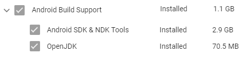
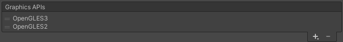
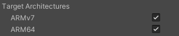

# Virtual ISL Dictionary

An application that uses a virtual hand model and a series of pre-programmed movements to display ISL signs on request.

This project is being developed as part of Microsoft's 2020 Hackathon. You can find the project page [here](https://garagehackbox.azurewebsites.net/hackathons/2107/projects/92241).

## Getting Started

**Note:** if you are having trouble with any of the steps below [this video](https://www.youtube.com/watch?v=NJAg9C1YdfI) might be helpful.

### Prerequisites

1. Install [Flutter](https://flutter.dev/docs/get-started/install/windows)
    - Installing Flutter will also involve installing Android Studio as well as the Android SDK
2. *(Optional)* Install [Visual Studio Code](https://code.visualstudio.com/download) (also install the *Dart* and *Flutter* plugins)

**Note:** if you plan on making changes to the Unity project you will need to carry out the following steps as well:

1. Install [Blender](https://www.blender.org/download/)
2. Install [Unity (version 2019.3.5f1)](https://unity3d.com/unity/whats-new/2019.3.5) and include *Android Build Support*
    

### Running the Flutter application

1. Clone the repository
2. Open the folder `virtual_isl_dictionary` in Visual Studio Code
3. Ensure you have an Android emulator or device connected
4. Open the file `lib/main.dart`
5. Click *Run > Start Debugging* in Visual Studio Code

### Making changes to the Unity application

1. Open the folder `virtual_isl_dictionary/unity/HandController` in Unity
2. *(Optional)* Make changes to the project
3. Click *File > Build Settings*
4. Ensure Android is selected as the build platform
    - Select *Android* and if a button saying *Switch Platform* appears then click it, otherwise do nothing
5. Click *Player Settings*
6. Choose the *Player* section
7. In *Other Settings* ensure the following settings are selected:
    - 
    - 
    - 
    - 
8. Close the settings windows
9. Click *Flutter > Export Android (Unity 2019.3.\*)*
10. Once the build has completed copy and replace this file `virtual_isl_dictionary/android/unity-classes/unity-classes.jar` with this file `virtual_isl_dictionary/android/UnityExport/libs/unity-classes.jar`
